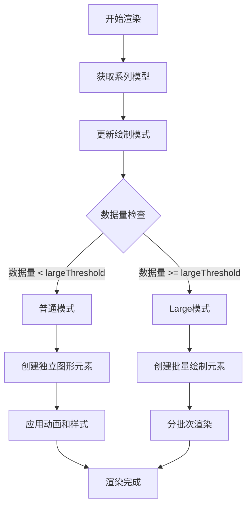
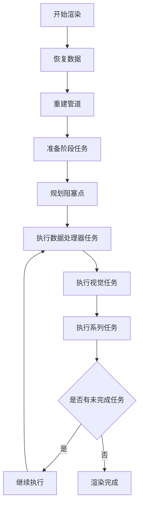

# ECharts 6.0 柱形图渲染流程详解

## 目录
- [第一章：渲染流程概述](#第一章渲染流程概述)
- [第二章：全量渲染模式详解](#第二章全量渲染模式详解)
- [第三章：增量渲染模式详解](#第三章增量渲染模式详解)
- [第四章：调度器与任务系统](#第四章调度器与任务系统)
- [第五章：布局计算与坐标转换](#第五章布局计算与坐标转换)
- [第六章：性能优化策略](#第六章性能优化策略)

---

## 附录 A：常用配置示例

### A.1 基础柱形图（笛卡尔）

```typescript
const option = {
  xAxis: { type: 'category', data: ['A','B','C','D'] },
  yAxis: { type: 'value' },
  series: [{ type: 'bar', data: [120, 200, 150, 80] }]
};
```

### A.2 大数据优化（Large + DirtyRect）

```typescript
const chart = echarts.init(dom, null, { useDirtyRect: true });
const option = {
  xAxis: { type: 'category', data: bigCategories },
  yAxis: { type: 'value' },
  series: [{
    type: 'bar',
    data: bigValues,
    large: true,
    largeThreshold: 4000
  }]
};
```

### A.3 渐进式渲染（Progressive）

```typescript
const option = {
  xAxis: { type: 'category', data: bigCategories },
  yAxis: { type: 'value' },
  series: [{
    type: 'bar',
    data: bigValues,
    progressive: 1000,
    progressiveThreshold: 3000
  }]
};
```

### A.4 实时排序（realtimeSort）

```typescript
const option = {
  xAxis: { type: 'category' },
  yAxis: { type: 'value' },
  dataset: { source: rows },
  series: [{ type: 'bar', realtimeSort: true }]
};
```

### A.5 精准替换系列集合（replaceMerge）

```typescript
chart.setOption({ series: newSeries }, { replaceMerge: ['series'] });
```

---

## 附录 B：调试与测试建议

- 单元测试框架：参考 `test/ut/jest.config.cjs`（jsdom + ts-jest）。
- 常用 Helper：`test/ut/core/utHelper.ts` 提供 `createChart/removeChart/getECModel`。
- 断言建议：
  - 模型层：`GlobalModel.getComponent/eachSeries`、`replaceMerge` 合并策略。
  - 视图层：通过 `getViewGroup` 或元素数量/属性断言。
  - 交互层：`dispatchAction` 后仅断言 `updateView/updateVisual` 阶段变化。
- 视觉回归：使用 `test/` 下 HTML 用例进行手工对比与回归。

示例（伪代码）：

```typescript
const chart = createChart({ width: 600, height: 400 });
chart.setOption({ series: [{ type: 'bar', data: [1,2,3] }] });
// 断言模型/视图
const ecModel = getECModel(chart);
// ...
removeChart(chart);
```

---

## 附录 C：API / 源码速查表

- 实例入口与生命周期：`src/core/echarts.ts` → `init/setOption/dispatchAction`。
- 全局模型：`src/model/Global.ts` → `setOption/_resetOption/restoreData`。
- 调度器与任务：`src/core/Scheduler.ts` → `updateStreamModes/perform*/plan`。
- 柱形图视图：`src/chart/bar/BarView.ts` → `render/_renderNormal/_renderLarge`。
- 柱形图系列：`src/chart/bar/BarSeries.ts` → `getInitialData/getProgressive*`。
- 布局：`src/layout/barGrid.ts` → `layout/createProgressiveLayout`。
- 渲染器注册：`src/renderer/installCanvasRenderer.ts` / `installSVGRenderer.ts`。

代码引用样例：

```207:232:src/core/Scheduler.ts
updateStreamModes(seriesModel, view) {
  const pipeline = this._pipelineMap.get(seriesModel.uid);
  const dataLen = seriesModel.getData().count();
  const progressiveRender = pipeline.progressiveEnabled && view.incrementalPrepareRender && dataLen >= pipeline.threshold;
  const large = seriesModel.get('large') && dataLen >= seriesModel.get('largeThreshold');
  const modDataCount = seriesModel.get('progressiveChunkMode') === 'mod' ? dataLen : null;
  seriesModel.pipelineContext = pipeline.context = { progressiveRender, modDataCount, large };
}
```

---

## 附录 D：术语表

- **Progressive 渐进式渲染**：按帧批量处理数据以平滑渲染的策略。
- **Large 模式**：以批量路径（LargePath）绘制，显著减少元素数量的高吞吐模式。
- **脏矩形（Dirty Rect）**：只重绘发生变化的区域以减少全量重绘。
- **Pipeline 管道**：按系列组织的任务链路，承载阈值、步长、上下文等。
- **Task（plan/reset/progress）**：任务生命周期，驱动数据→视觉→布局→视图执行。
- **replaceMerge**：`setOption` 的精准替换选项，避免不必要的合并与历史残留。

---

## 附录 E：参考与链接

- ECharts 官方文档与示例：`https://echarts.apache.org/`
- zrender 文档：`https://ecomfe.github.io/zrender/`
- 本仓库测试与用例：`test/` 目录
- 本分支版本信息：根目录 `package.json` → `version: 6.0.0`

## 第一章：渲染流程概述

### 1.1 渲染模式分类

ECharts 6.0 中柱形图支持三种主要的渲染模式：

1. **普通模式（Normal Mode）**：适用于数据量较小的场景
2. **Large 模式**：适用于大数据量场景，使用批量绘制优化
3. **Progressive 模式**：增量渲染模式，分批次逐步渲染

### 1.2 核心入口代码

#### 主渲染入口

```typescript
// src/chart/bar/BarView.ts
render(seriesModel: BarSeriesModel, ecModel: GlobalModel, api: ExtensionAPI, payload: Payload) {
    this._model = seriesModel;

    // 移除之前的渲染监听器，避免重复绑定
    this._removeOnRenderedListener(api);

    // 根据数据量和配置更新绘制模式
    this._updateDrawMode(seriesModel);

    const coordinateSystemType = seriesModel.get('coordinateSystem');

    // 只支持笛卡尔坐标系和极坐标系
    if (coordinateSystemType === 'cartesian2d' || coordinateSystemType === 'polar') {
        // 清除之前的渐进式渲染元素
        this._progressiveEls = null;

        // 根据绘制模式选择渲染方法
        this._isLargeDraw
            ? this._renderLarge(seriesModel, ecModel, api)      // Large 模式渲染
            : this._renderNormal(seriesModel, ecModel, api, payload); // 普通模式渲染
    }
    else if (__DEV__) {
        warn('Only cartesian2d and polar supported for bar.');
    }
}
```

**代码注释说明：**
- `_removeOnRenderedListener(api)`: 清理之前的渲染完成监听器，防止内存泄漏
- `_updateDrawMode(seriesModel)`: 根据数据量和配置项判断使用哪种渲染模式
- `_progressiveEls = null`: 重置渐进式渲染元素数组
- `_isLargeDraw`: 布尔值，标识是否使用 Large 模式

#### 绘制模式判断

```typescript
// src/chart/bar/BarView.ts
private _updateDrawMode(seriesModel: BarSeriesModel): void {
    // 从系列模型的管道上下文中获取 large 模式标识
    const isLargeDraw = seriesModel.pipelineContext.large;
    
    // 如果绘制模式发生变化，需要重新设置并清空当前内容
    if (this._isLargeDraw == null || isLargeDraw !== this._isLargeDraw) {
        this._isLargeDraw = isLargeDraw;
        this._clear(); // 清空当前渲染内容
    }
}
```

**代码注释说明：**
- `seriesModel.pipelineContext.large`: 调度器设置的 Large 模式标识
- `this._isLargeDraw`: 当前视图的绘制模式缓存
- `this._clear()`: 清空当前组内的所有图形元素

### 1.3 渲染模式决策流程



### 1.4 关键配置参数

| 参数 | 类型 | 默认值 | 说明 |
|------|------|--------|------|
| `large` | boolean | false | 是否启用 Large 模式 |
| `largeThreshold` | number | 4000 | 启用 Large 模式的数据量阈值 |
| `progressive` | number | 400 | 渐进式渲染每批处理的数据量 |
| `progressiveThreshold` | number | 3000 | 启用渐进式渲染的数据量阈值 |

### 1.5 坐标系支持

柱形图支持两种坐标系：

1. **笛卡尔坐标系（cartesian2d）**
   - 支持水平柱形图和垂直柱形图
   - 支持堆叠和分组显示
   - 支持实时排序功能

2. **极坐标系（polar）**
   - 支持径向柱形图和切向柱形图
   - 支持扇形和香肠形状
   - 支持圆角效果

---

## 第二章：全量渲染模式详解

### 2.1 全量渲染概述

全量渲染模式是 ECharts 柱形图的默认渲染方式，适用于数据量相对较小的场景。在这种模式下，每个柱形都会创建独立的图形元素，支持完整的动画效果和交互功能。

### 2.2 核心渲染方法

#### 主渲染方法

```typescript
// src/chart/bar/BarView.ts
private _renderNormal(
    seriesModel: BarSeriesModel,
    ecModel: GlobalModel,
    api: ExtensionAPI,
    payload: Payload
): void {
    const group = this.group;           // 获取图形组容器
    const data = seriesModel.getData(); // 获取系列数据
    const oldData = this._data;         // 获取上一次渲染的数据

    const coord = seriesModel.coordinateSystem; // 获取坐标系
    const baseAxis = coord.getBaseAxis();       // 获取基础轴（类目轴）
    
    // 判断是否为水平方向（笛卡尔坐标系）或径向（极坐标系）
    let isHorizontalOrRadial: boolean;
    if (coord.type === 'cartesian2d') {
        isHorizontalOrRadial = (baseAxis as Axis2D).isHorizontal();
    }
    else if (coord.type === 'polar') {
        isHorizontalOrRadial = baseAxis.dim === 'angle';
    }

    // 获取动画模型（如果启用了动画）
    const animationModel = seriesModel.isAnimationEnabled() ? seriesModel : null;

    // 检查是否启用实时排序功能
    const realtimeSortCfg = shouldRealtimeSort(seriesModel, coord);

    if (realtimeSortCfg) {
        this._enableRealtimeSort(realtimeSortCfg, data, api);
    }

    // 配置裁剪和背景相关参数
    const needsClip = seriesModel.get('clip', true) || realtimeSortCfg;
    const coordSysClipArea = getClipArea(coord, data);
    group.removeClipPath(); // 移除之前可能存在的裁剪路径

    const roundCap = seriesModel.get('roundCap', true); // 圆角配置
    const drawBackground = seriesModel.get('showBackground', true); // 是否绘制背景
    const backgroundModel = seriesModel.getModel('backgroundStyle');
    const barBorderRadius = backgroundModel.get('borderRadius') || 0;

    // 背景元素数组
    const bgEls: BarView['_backgroundEls'] = [];
    const oldBgEls = this._backgroundEls;

    // 检查是否为初始化排序或轴顺序变更
    const isInitSort = payload && payload.isInitSort;
    const isChangeOrder = payload && payload.type === 'changeAxisOrder';

    // 创建背景元素的函数
    function createBackground(dataIndex: number) {
        const bgLayout = getLayout[coord.type](data, dataIndex);
        if (!bgLayout) {
            return null;
        }
        const bgEl = createBackgroundEl(coord, isHorizontalOrRadial, bgLayout);
        bgEl.useStyle(backgroundModel.getItemStyle());
        
        // 只有笛卡尔坐标系支持圆角
        if (coord.type === 'cartesian2d') {
            (bgEl as Rect).setShape('r', barBorderRadius);
        }
        else {
            (bgEl as Sector).setShape('cornerRadius', barBorderRadius);
        }
        bgEls[dataIndex] = bgEl;
        return bgEl;
    }

    // 使用数据差异对比进行增量更新
    data.diff(oldData)
        .add(function (dataIndex) {
            // 新增数据点的处理逻辑
        })
        .update(function (newIndex, oldIndex) {
            // 更新数据点的处理逻辑
        })
        .remove(function (dataIndex) {
            // 移除数据点的处理逻辑
        })
        .execute(); // 执行差异更新

    // 处理背景元素组
    const bgGroup = this._backgroundGroup || (this._backgroundGroup = new Group());
    bgGroup.removeAll();

    for (let i = 0; i < bgEls.length; ++i) {
        bgGroup.add(bgEls[i]);
    }
    group.add(bgGroup);
    this._backgroundEls = bgEls;

    this._data = data; // 更新当前数据引用
}
```

**代码注释说明：**
- `group`: zrender 图形组，包含所有柱形元素
- `data.diff(oldData)`: 数据差异对比，实现增量更新
- `coordSysClipArea`: 坐标系裁剪区域，用于边界裁剪
- `realtimeSortCfg`: 实时排序配置，支持动态排序功能

### 2.3 数据差异更新机制

#### 新增数据点处理

```typescript
// src/chart/bar/BarView.ts
.add(function (dataIndex) {
    const itemModel = data.getItemModel<BarDataItemOption>(dataIndex);
    const layout = getLayout[coord.type](data, dataIndex, itemModel);
    if (!layout) {
        return; // 如果布局信息无效，跳过
    }

    // 如果需要绘制背景，先创建背景元素
    if (drawBackground) {
        createBackground(dataIndex);
    }

    // 检查数据值是否有效
    if (!data.hasValue(dataIndex) || !isValidLayout[coord.type](layout)) {
        return;
    }

    let isClipped = false;
    // 如果需要裁剪，进行边界裁剪处理
    if (needsClip) {
        // 裁剪会修改布局参数，并返回是否完全被裁剪
        isClipped = clip[coord.type](coordSysClipArea, layout);
    }

    // 根据坐标系类型创建对应的图形元素
    const el = elementCreator[coord.type](
        seriesModel,
        data,
        dataIndex,
        layout,
        isHorizontalOrRadial,
        animationModel,
        baseAxis.model,
        false, // isUpdate = false
        roundCap
    );

    // 如果启用实时排序，强制标签动画
    if (realtimeSortCfg) {
        (el as ECElement).forceLabelAnimation = true;
    }

    // 更新元素样式
    updateStyle(
        el, data, dataIndex, itemModel, layout,
        seriesModel, isHorizontalOrRadial, coord.type === 'polar'
    );

    // 根据不同的排序状态应用不同的动画
    if (isInitSort) {
        (el as Rect).attr({ shape: layout });
    }
    else if (realtimeSortCfg) {
        updateRealtimeAnimation(
            realtimeSortCfg,
            animationModel,
            el as Rect,
            layout as LayoutRect,
            dataIndex,
            isHorizontalOrRadial,
            false, // isUpdate = false
            false  // isChangeOrder = false
        );
    }
    else {
        // 应用入场动画
        initProps(el, {shape: layout} as any, seriesModel, dataIndex);
    }

    // 将元素关联到数据项
    data.setItemGraphicEl(dataIndex, el);
    group.add(el);
    el.ignore = isClipped; // 设置是否忽略渲染（被裁剪）
})
```

**代码注释说明：**
- `itemModel`: 单个数据项的模型，包含样式配置
- `layout`: 计算得到的布局信息（位置、尺寸等）
- `isClipped`: 是否被坐标系边界裁剪
- `elementCreator`: 元素创建器，根据坐标系类型创建对应元素
- `initProps`: 应用入场动画属性

#### 更新数据点处理

```typescript
// src/chart/bar/BarView.ts
.update(function (newIndex, oldIndex) {
    const itemModel = data.getItemModel<BarDataItemOption>(newIndex);
    const layout = getLayout[coord.type](data, newIndex, itemModel);
    if (!layout) {
        return;
    }

    // 处理背景元素更新
    if (drawBackground) {
        let bgEl: Rect | Sector;
        if (oldBgEls.length === 0) {
            bgEl = createBackground(oldIndex);
        }
        else {
            bgEl = oldBgEls[oldIndex];
            bgEl.useStyle(backgroundModel.getItemStyle());
            
            // 更新圆角设置
            if (coord.type === 'cartesian2d') {
                (bgEl as Rect).setShape('r', barBorderRadius);
            }
            else {
                (bgEl as Sector).setShape('cornerRadius', barBorderRadius);
            }
            bgEls[newIndex] = bgEl;
        }
        
        const bgLayout = getLayout[coord.type](data, newIndex);
        const shape = createBackgroundShape(isHorizontalOrRadial, bgLayout, coord);
        updateProps<RectProps | SectorProps>(bgEl, { shape }, animationModel, newIndex);
    }

    // 获取旧的图形元素
    let el = oldData.getItemGraphicEl(oldIndex) as BarPossiblePath;
    if (!data.hasValue(newIndex) || !isValidLayout[coord.type](layout)) {
        group.remove(el);
        return;
    }

    let isClipped = false;
    if (needsClip) {
        isClipped = clip[coord.type](coordSysClipArea, layout);
        if (isClipped) {
            group.remove(el);
        }
    }

    // 检查圆角设置是否发生变化
    const roundCapChanged = el && (el.type === 'sector' && roundCap || el.type === 'sausage' && !roundCap);
    if (roundCapChanged) {
        // 圆角设置变化时，无法使用动画过渡，需要重新创建元素
        el && removeElementWithFadeOut(el, seriesModel, oldIndex);
        el = null;
    }

    if (!el) {
        // 创建新元素
        el = elementCreator[coord.type](
            seriesModel,
            data,
            newIndex,
            layout,
            isHorizontalOrRadial,
            animationModel,
            baseAxis.model,
            true, // isUpdate = true
            roundCap
        );
    }
    else {
        // 保存旧样式用于动画过渡
        saveOldStyle(el);
    }

    // 应用样式和动画
    if (realtimeSortCfg) {
        (el as ECElement).forceLabelAnimation = true;
    }

    if (isChangeOrder) {
        // 处理轴顺序变更时的标签动画
        const textEl = el.getTextContent();
        if (textEl) {
            const labelInnerStore = labelInner(textEl);
            if (labelInnerStore.prevValue != null) {
                labelInnerStore.prevValue = labelInnerStore.value;
            }
        }
    }
    else {
        // 更新元素样式
        updateStyle(
            el, data, newIndex, itemModel, layout,
            seriesModel, isHorizontalOrRadial, coord.type === 'polar'
        );
    }

    // 应用动画
    if (isInitSort) {
        (el as Rect).attr({ shape: layout });
    }
    else if (realtimeSortCfg) {
        updateRealtimeAnimation(
            realtimeSortCfg,
            animationModel,
            el as Rect,
            layout as LayoutRect,
            newIndex,
            isHorizontalOrRadial,
            true,  // isUpdate = true
            isChangeOrder
        );
    }
    else {
        // 应用更新动画
        updateProps(el, {
            shape: layout
        } as any, seriesModel, newIndex, null);
    }

    data.setItemGraphicEl(newIndex, el);
    el.ignore = isClipped;
    group.add(el);
})
```

**代码注释说明：**
- `newIndex/oldIndex`: 新数据索引和旧数据索引
- `roundCapChanged`: 圆角设置是否发生变化
- `saveOldStyle`: 保存旧样式用于动画过渡
- `updateProps`: 应用更新动画属性

#### 移除数据点处理

```typescript
// src/chart/bar/BarView.ts
.remove(function (dataIndex) {
    const el = oldData.getItemGraphicEl(dataIndex) as Path;
    el && removeElementWithFadeOut(el, seriesModel, dataIndex);
})
```

**代码注释说明：**
- `removeElementWithFadeOut`: 移除元素并应用淡出动画

### 2.4 图形元素创建

#### 笛卡尔坐标系元素创建

```typescript
// src/chart/bar/BarView.ts
const elementCreator: {
    [key in 'polar' | 'cartesian2d']: ElementCreator
} = {
    cartesian2d(
        seriesModel, data, newIndex, layout: RectLayout, isHorizontal,
        animationModel, axisModel, isUpdate, roundCap
    ) {
        // 创建矩形元素
        const rect = new Rect({
            shape: extend({}, layout), // 复制布局信息
            z2: 1 // 设置层级
        });
        (rect as any).__dataIndex = newIndex; // 关联数据索引

        rect.name = 'item'; // 设置元素名称

        // 如果启用动画，设置初始动画状态
        if (animationModel) {
            const rectShape = rect.shape;
            const animateProperty = isHorizontal ? 'height' : 'width' as 'width' | 'height';
            rectShape[animateProperty] = 0; // 初始高度或宽度为0
        }
        return rect;
    }
}
```

**代码注释说明：**
- `Rect`: zrender 矩形元素类
- `z2`: 图形层级，数值越大越在上层
- `animateProperty`: 动画属性，水平方向动画高度，垂直方向动画宽度

#### 极坐标系元素创建

```typescript
// src/chart/bar/BarView.ts
polar(
    seriesModel, data, newIndex, layout: SectorLayout, isRadial: boolean,
    animationModel, axisModel, isUpdate, roundCap
) {
    // 根据圆角设置选择形状类
    const ShapeClass = (!isRadial && roundCap) ? Sausage : Sector;
    const sector = new ShapeClass({
        shape: layout,
        z2: 1
    });

    sector.name = 'item';

    // 设置文本位置计算函数
    const positionMap = createPolarPositionMapping(isRadial);
    sector.calculateTextPosition = createSectorCalculateTextPosition(positionMap, {
        isRoundCap: ShapeClass === Sausage
    });

    // 应用动画
    if (animationModel) {
        const sectorShape = sector.shape;
        const animateProperty = isRadial ? 'r' : 'endAngle' as 'r' | 'endAngle';
        const animateTarget = {} as SectorShape;
        sectorShape[animateProperty] = isRadial ? layout.r0 : layout.startAngle;
        animateTarget[animateProperty] = layout[animateProperty];
        
        (isUpdate ? updateProps : initProps)(sector, {
            shape: animateTarget
        }, animationModel);
    }

    return sector;
}
```

**代码注释说明：**
- `Sausage`: 香肠形状（带圆角的扇形）
- `Sector`: 普通扇形
- `isRadial`: 是否为径向柱形图
- `calculateTextPosition`: 文本位置计算函数

### 2.5 样式更新机制

```typescript
// src/chart/bar/BarView.ts
function updateStyle(
    el: BarPossiblePath,
    data: SeriesData,
    dataIndex: number,
    itemModel: Model<BarDataItemOption>,
    layout: RectLayout | SectorLayout,
    seriesModel: BarSeriesModel,
    isHorizontalOrRadial: boolean,
    isPolar: boolean
) {
    // 获取视觉样式
    const style = data.getItemVisual(dataIndex, 'style');

    // 设置圆角
    if (!isPolar) {
        const borderRadius = itemModel
            .get(['itemStyle', 'borderRadius']) as number | number[] || 0;
        (el as Rect).setShape('r', borderRadius);
    }
    else if (!seriesModel.get('roundCap')) {
        const sectorShape = (el as Sector).shape;
        const cornerRadius = getSectorCornerRadius(
            itemModel.getModel('itemStyle'),
            sectorShape,
            true
        );
        extend(sectorShape, cornerRadius);
        (el as Sector).setShape(sectorShape);
    }

    // 应用样式
    el.useStyle(style);

    // 设置鼠标样式
    const cursorStyle = itemModel.getShallow('cursor');
    cursorStyle && (el as Path).attr('cursor', cursorStyle);

    // 计算标签位置
    const labelPositionOutside = isPolar
        ? (isHorizontalOrRadial
            ? ((layout as SectorLayout).r >= (layout as SectorLayout).r0 ? 'endArc' : 'startArc')
            : ((layout as SectorLayout).endAngle >= (layout as SectorLayout).startAngle
                ? 'endAngle'
                : 'startAngle'
            )
        )
        : (isHorizontalOrRadial
            ? ((layout as RectLayout).height >= 0 ? 'bottom' : 'top')
            : ((layout as RectLayout).width >= 0 ? 'right' : 'left'));

    // 设置标签样式
    const labelStatesModels = getLabelStatesModels(itemModel);
    setLabelStyle(
        el, labelStatesModels,
        {
            labelFetcher: seriesModel,
            labelDataIndex: dataIndex,
            defaultText: getDefaultLabel(seriesModel.getData(), dataIndex),
            inheritColor: style.fill as ColorString,
            defaultOpacity: style.opacity,
            defaultOutsidePosition: labelPositionOutside as BuiltinTextPosition
        }
    );

    // 处理极坐标系的标签旋转
    const label = el.getTextContent();
    if (isPolar && label) {
        const position = itemModel.get(['label', 'position']);
        el.textConfig.inside = position === 'middle' ? true : null;
        setSectorTextRotation(
            el as Sector,
            position === 'outside' ? labelPositionOutside : position,
            createPolarPositionMapping(isHorizontalOrRadial),
            itemModel.get(['label', 'rotate'])
        );
    }

    // 设置标签值动画
    setLabelValueAnimation(
        label,
        labelStatesModels,
        seriesModel.getRawValue(dataIndex) as ParsedValue,
        (value: number) => getDefaultInterpolatedLabel(data, value)
    );

    // 设置交互状态样式
    const emphasisModel = itemModel.getModel(['emphasis']);
    toggleHoverEmphasis(el, emphasisModel.get('focus'), emphasisModel.get('blurScope'), emphasisModel.get('disabled'));
    setStatesStylesFromModel(el, itemModel);

    // 处理零值情况（极坐标系）
    if (isZeroOnPolar(layout as SectorLayout)) {
        el.style.fill = 'none';
        el.style.stroke = 'none';
        each(el.states, (state) => {
            if (state.style) {
                state.style.fill = state.style.stroke = 'none';
            }
        });
    }
}
```

**代码注释说明：**
- `data.getItemVisual(dataIndex, 'style')`: 获取数据项的视觉样式
- `el.useStyle(style)`: 应用样式到图形元素
- `setLabelStyle`: 设置标签样式
- `toggleHoverEmphasis`: 设置悬停强调效果
- `setStatesStylesFromModel`: 从模型设置状态样式

---

## 第三章：增量渲染模式详解

### 3.1 增量渲染概述

增量渲染模式是 ECharts 6.0 中用于处理大数据量场景的重要优化技术。当数据量超过设定阈值时，系统会自动切换到增量渲染模式，通过分批次逐步渲染数据来避免浏览器卡顿，提升用户体验。

### 3.2 增量渲染入口

#### 增量渲染准备

```typescript
// src/chart/bar/BarView.ts
incrementalPrepareRender(seriesModel: BarSeriesModel): void {
    this._clear(); // 清空当前渲染内容
    this._updateDrawMode(seriesModel); // 更新绘制模式
    
    // 增量渲染也需要裁剪，否则可能会溢出
    // 但不要在每一帧都设置裁剪，否则所有子元素都会被标记为重绘
    this._updateLargeClip(seriesModel);
}
```

**代码注释说明：**
- `_clear()`: 清空当前组内的所有图形元素
- `_updateDrawMode()`: 根据数据量更新绘制模式
- `_updateLargeClip()`: 更新 Large 模式的裁剪设置

#### 增量渲染执行

```typescript
// src/chart/bar/BarView.ts
incrementalRender(params: StageHandlerProgressParams, seriesModel: BarSeriesModel): void {
    // 重置渐进式元素数组
    this._progressiveEls = [];
    
    // 普通模式不支持渐进式渲染，只支持 Large 模式
    this._incrementalRenderLarge(params, seriesModel);
}
```

**代码注释说明：**
- `params`: 阶段处理器进度参数，包含当前批次的数据范围
- `_progressiveEls`: 渐进式渲染元素数组，用于跟踪渲染的元素
- `_incrementalRenderLarge()`: Large 模式的增量渲染实现

### 3.3 Large 模式渲染

#### Large 模式全量渲染

```typescript
// src/chart/bar/BarView.ts
private _renderLarge(seriesModel: BarSeriesModel, ecModel: GlobalModel, api: ExtensionAPI): void {
    this._clear(); // 清空当前内容
    createLarge(seriesModel, this.group); // 创建 Large 模式元素
    this._updateLargeClip(seriesModel); // 更新裁剪设置
}
```

**代码注释说明：**
- `createLarge()`: 创建 Large 模式的批量绘制元素
- `_updateLargeClip()`: 设置坐标系裁剪路径

#### Large 模式增量渲染

```typescript
// src/chart/bar/BarView.ts
private _incrementalRenderLarge(params: StageHandlerProgressParams, seriesModel: BarSeriesModel): void {
    this._removeBackground(); // 移除背景元素
    createLarge(seriesModel, this.group, this._progressiveEls, true); // 创建增量元素
}
```

**代码注释说明：**
- `_removeBackground()`: 移除背景元素组
- `createLarge(..., true)`: 第四个参数表示是否为增量渲染

### 3.4 Large 模式元素创建

#### 核心创建函数

```typescript
// src/chart/bar/BarView.ts
function createLarge(
    seriesModel: BarSeriesModel,
    group: Group,
    progressiveEls?: Element[],
    incremental?: boolean
) {
    // TODO: 目前只支持笛卡尔坐标系，极坐标系待支持
    const data = seriesModel.getData();
    const baseDimIdx = data.getLayout('valueAxisHorizontal') ? 1 : 0; // 基础维度索引

    // 获取 Large 模式的数据索引和柱宽
    const largeDataIndices = data.getLayout('largeDataIndices');
    const barWidth = data.getLayout('size');

    // 背景样式配置
    const backgroundModel = seriesModel.getModel('backgroundStyle');
    const bgPoints = data.getLayout('largeBackgroundPoints');

    // 创建背景元素（如果存在）
    if (bgPoints) {
        const bgEl = new LargePath({
            shape: {
                points: bgPoints // 背景点数据
            },
            incremental: !!incremental, // 是否为增量渲染
            silent: true, // 静默模式，不响应事件
            z2: 0 // 背景层级
        });
        
        // 设置背景元素属性
        bgEl.baseDimIdx = baseDimIdx;
        bgEl.largeDataIndices = largeDataIndices;
        bgEl.barWidth = barWidth;
        bgEl.useStyle(backgroundModel.getItemStyle());
        group.add(bgEl);

        // 如果是增量渲染，添加到渐进式元素数组
        progressiveEls && progressiveEls.push(bgEl);
    }

    // 创建主柱形元素
    const el = new LargePath({
        shape: {points: data.getLayout('largePoints')}, // 柱形点数据
        incremental: !!incremental,
        ignoreCoarsePointer: true, // 忽略粗糙指针事件
        z2: 1 // 主元素层级
    });
    
    // 设置主元素属性
    el.baseDimIdx = baseDimIdx;
    el.largeDataIndices = largeDataIndices;
    el.barWidth = barWidth;
    group.add(el);
    el.useStyle(data.getVisual('style')); // 应用视觉样式
    
    // 描边在填充之前渲染，避免重叠
    el.style.stroke = null;
    
    // 启用 tooltip 和用户鼠标/触摸事件处理器
    getECData(el).seriesIndex = seriesModel.seriesIndex;

    // 如果系列不是静默模式，绑定鼠标事件
    if (!seriesModel.get('silent')) {
        el.on('mousedown', largePathUpdateDataIndex);
        el.on('mousemove', largePathUpdateDataIndex);
    }
    
    // 如果是增量渲染，添加到渐进式元素数组
    progressiveEls && progressiveEls.push(el);
}
```

**代码注释说明：**
- `LargePath`: 自定义的批量绘制路径类
- `baseDimIdx`: 基础维度索引，用于确定绘制方向
- `largeDataIndices`: Large 模式的数据索引数组
- `largePoints/largeBackgroundPoints`: 预计算的点数据数组

#### LargePath 类定义

```typescript
// src/chart/bar/BarView.ts
class LagePathShape {
    points: ArrayLike<number>; // 点数据数组
}

interface LargePathProps extends PathProps {
    shape?: LagePathShape
}

class LargePath extends Path<LargePathProps> {
    type = 'largeBar'; // 元素类型标识

    shape: LagePathShape;
    baseDimIdx: number; // 基础维度索引
    largeDataIndices: ArrayLike<number>; // 数据索引数组
    barWidth: number; // 柱宽

    constructor(opts?: LargePathProps) {
        super(opts);
    }

    getDefaultShape() {
        return new LagePathShape();
    }

    // 自定义绘制方法
    buildPath(ctx: CanvasRenderingContext2D, shape: LagePathShape) {
        // 绘制线条比绘制整个线条或矩形更高效
        const points = shape.points;
        const baseDimIdx = this.baseDimIdx;
        const valueDimIdx = 1 - this.baseDimIdx; // 值维度索引
        const startPoint = [];
        const size = [];
        const barWidth = this.barWidth;

        // 遍历点数据，每3个点为一组 (x, y, value)
        for (let i = 0; i < points.length; i += 3) {
            size[baseDimIdx] = barWidth; // 设置柱宽
            size[valueDimIdx] = points[i + 2]; // 设置柱高
            startPoint[baseDimIdx] = points[i + baseDimIdx]; // 设置起始位置
            startPoint[valueDimIdx] = points[i + valueDimIdx];

            // 绘制矩形
            ctx.rect(startPoint[0], startPoint[1], size[0], size[1]);
        }
    }
}
```

**代码注释说明：**
- `buildPath()`: 自定义绘制方法，使用 Canvas API 批量绘制矩形
- `points[i + 2]`: 点数据中第三个值表示柱形的高度或宽度
- `ctx.rect()`: Canvas 绘制矩形方法

### 3.5 交互事件处理

#### 数据索引更新

```typescript
// src/chart/bar/BarView.ts
// 使用节流避免频繁遍历查找数据索引
const largePathUpdateDataIndex = throttle(function (this: LargePath, event: ZRElementEvent) {
    const largePath = this;
    const dataIndex = largePathFindDataIndex(largePath, event.offsetX, event.offsetY);
    getECData(largePath).dataIndex = dataIndex >= 0 ? dataIndex : null;
}, 30, false); // 30ms 节流
```

**代码注释说明：**
- `throttle()`: 节流函数，限制函数调用频率
- `largePathFindDataIndex()`: 根据鼠标坐标查找对应的数据索引
- `getECData()`: 获取元素的 ECharts 数据

#### 数据索引查找

```typescript
// src/chart/bar/BarView.ts
function largePathFindDataIndex(largePath: LargePath, x: number, y: number) {
    const baseDimIdx = largePath.baseDimIdx;
    const valueDimIdx = 1 - baseDimIdx;
    const points = largePath.shape.points;
    const largeDataIndices = largePath.largeDataIndices;
    const startPoint = [];
    const size = [];
    const barWidth = largePath.barWidth;

    // 遍历所有柱形，检查鼠标位置是否在其中
    for (let i = 0, len = points.length / 3; i < len; i++) {
        const ii = i * 3;
        size[baseDimIdx] = barWidth;
        size[valueDimIdx] = points[ii + 2];
        startPoint[baseDimIdx] = points[ii + baseDimIdx];
        startPoint[valueDimIdx] = points[ii + valueDimIdx];
        
        // 处理负值情况
        if (size[valueDimIdx] < 0) {
            startPoint[valueDimIdx] += size[valueDimIdx];
            size[valueDimIdx] = -size[valueDimIdx];
        }

        // 检查鼠标位置是否在矩形范围内
        if (x >= startPoint[0] && x <= startPoint[0] + size[0]
            && y >= startPoint[1] && y <= startPoint[1] + size[1]
        ) {
            return largeDataIndices[i]; // 返回对应的数据索引
        }
    }

    return -1; // 未找到匹配的数据
}
```

**代码注释说明：**
- `points.length / 3`: 计算柱形数量，每3个点代表一个柱形
- `startPoint[0] + size[0]`: 计算矩形的右边界
- `largeDataIndices[i]`: 返回对应的原始数据索引

### 3.6 裁剪处理

#### 裁剪更新

```typescript
// src/chart/bar/BarView.ts
private _updateLargeClip(seriesModel: BarSeriesModel): void {
    // 在 Large 模式中使用 clipPath
    const clipPath = seriesModel.get('clip', true)
        && createClipPath(seriesModel.coordinateSystem, false, seriesModel);
    const group = this.group;
    
    if (clipPath) {
        group.setClipPath(clipPath); // 设置裁剪路径
    }
    else {
        group.removeClipPath(); // 移除裁剪路径
    }
}
```

**代码注释说明：**
- `createClipPath()`: 根据坐标系创建裁剪路径
- `setClipPath()`: 设置图形组的裁剪路径
- `removeClipPath()`: 移除裁剪路径

### 3.7 渐进式渲染配置

#### 系列模型配置

```typescript
// src/chart/bar/BarSeries.ts
/**
 * @override
 */
getProgressive() {
    // 普通模式不支持渐进式渲染
    return this.get('large')
        ? this.get('progressive')
        : false;
}

/**
 * @override
 */
getProgressiveThreshold() {
    // 普通模式不支持渐进式渲染
    let progressiveThreshold = this.get('progressiveThreshold');
    const largeThreshold = this.get('largeThreshold');
    
    // 如果 largeThreshold 大于 progressiveThreshold，使用 largeThreshold
    if (largeThreshold > progressiveThreshold) {
        progressiveThreshold = largeThreshold;
    }
    return progressiveThreshold;
}
```

**代码注释说明：**
- `getProgressive()`: 获取渐进式渲染配置
- `getProgressiveThreshold()`: 获取渐进式渲染阈值
- `largeThreshold`: Large 模式的阈值

### 3.8 性能优化特点

#### 批量绘制优势

1. **减少 DOM 元素数量**：使用单个 `LargePath` 元素替代大量独立元素
2. **优化绘制性能**：使用 Canvas API 批量绘制矩形
3. **内存使用优化**：减少图形元素的内存占用
4. **事件处理优化**：通过坐标计算实现交互，避免绑定大量事件监听器

#### 适用场景

- **大数据量**：数据量超过 `largeThreshold`（默认 4000）
- **性能优先**：对渲染性能要求较高的场景
- **简单交互**：不需要复杂动画效果的场景

#### 限制条件

- **动画限制**：不支持复杂的入场和退场动画
- **样式限制**：所有柱形使用统一的视觉样式
- **坐标系限制**：目前只支持笛卡尔坐标系

---

## 第四章：调度器与任务系统

### 4.1 调度器概述

ECharts 6.0 的调度器（Scheduler）是整个渲染系统的核心，负责协调各个阶段的处理任务，管理渲染流程的执行顺序，并支持渐进式渲染和性能优化。

### 4.2 调度器核心结构

#### 调度器类定义

```typescript
// src/core/Scheduler.ts
class Scheduler {
    readonly ecInstance: EChartsType; // ECharts 实例引用
    readonly api: ExtensionAPI; // 扩展 API

    // 共享状态，只能由本文件和 echarts.js 修改
    unfinished: boolean;

    private _dataProcessorHandlers: StageHandlerInternal[]; // 数据处理器
    private _visualHandlers: StageHandlerInternal[]; // 视觉处理器
    private _allHandlers: StageHandlerInternal[]; // 所有处理器

    // 任务记录映射，key: handlerUID
    private _stageTaskMap: HashMap<TaskRecord> = createHashMap<TaskRecord>();
    // 管道映射，key: pipelineId
    private _pipelineMap: HashMap<Pipeline>;

    constructor(
        ecInstance: EChartsType,
        api: ExtensionAPI,
        dataProcessorHandlers: StageHandlerInternal[],
        visualHandlers: StageHandlerInternal[]
    ) {
        this.ecInstance = ecInstance;
        this.api = api;

        // 修复当前处理器，防止在某些情况下处理器在 echarts 实例创建后注册
        // 为 echarts 实例增量注册处理器不被此流架构支持
        dataProcessorHandlers = this._dataProcessorHandlers = dataProcessorHandlers.slice();
        visualHandlers = this._visualHandlers = visualHandlers.slice();
        this._allHandlers = dataProcessorHandlers.concat(visualHandlers);
    }
}
```

**代码注释说明：**
- `StageHandlerInternal`: 阶段处理器内部接口
- `TaskRecord`: 任务记录类型，包含系列任务映射和整体任务
- `Pipeline`: 管道类型，管理任务链和执行上下文

#### 管道上下文类型

```typescript
// src/core/Scheduler.ts
export type Pipeline = {
    id: string // 管道 ID
    head: GeneralTask // 管道头部任务
    tail: GeneralTask // 管道尾部任务
    threshold: number // 渐进式渲染阈值
    progressiveEnabled: boolean // 是否启用渐进式渲染
    blockIndex: number // 阻塞点索引
    step: number // 渐进式步长
    count: number // 任务数量
    currentTask?: GeneralTask // 当前任务
    context?: PipelineContext // 管道上下文
};

export type PipelineContext = {
    progressiveRender: boolean // 是否渐进式渲染
    modDataCount: number // 取模数据数量
    large: boolean // 是否 Large 模式
};
```

**代码注释说明：**
- `head/tail`: 管道的头部和尾部任务，形成任务链
- `threshold`: 启用渐进式渲染的数据量阈值
- `blockIndex`: 阻塞点索引，用于确定渐进式渲染的起始位置

### 4.3 渲染模式判断

#### 流模式更新

```typescript
// src/core/Scheduler.ts
/**
 * 当前，渐进式渲染从视觉和布局开始
 * 总是在同一阶段检测渲染模式，避免因数据过滤导致的错误检测
 * 注意：`updateStreamModes` 使用 `seriesModel.getData()`
 */
updateStreamModes(seriesModel: SeriesModel<SeriesOption & SeriesLargeOptionMixin>, view: ChartView): void {
    const pipeline = this._pipelineMap.get(seriesModel.uid);
    const data = seriesModel.getData();
    const dataLen = data.count();

    // `progressiveRender` 意味着可以在每个动画帧中渐进式渲染
    // 注意：某些类型的系列不提供 `view.incrementalPrepareRender` 但支持 `chart.appendData`
    // 我们使用术语 `incremental` 而不是 `progressive` 来描述 `chart.appendData` 的情况
    const progressiveRender = pipeline.progressiveEnabled
        && view.incrementalPrepareRender
        && dataLen >= pipeline.threshold;

    const large = seriesModel.get('large') && dataLen >= seriesModel.get('largeThreshold');

    // TODO: 如果 `appendData`，modDataCount 不应该更新，否则会导致整个重绘
    // 参见 `test/candlestick-large3.html`
    const modDataCount = seriesModel.get('progressiveChunkMode') === 'mod' ? dataLen : null;

    seriesModel.pipelineContext = pipeline.context = {
        progressiveRender: progressiveRender,
        modDataCount: modDataCount,
        large: large
    };
}
```

**代码注释说明：**
- `progressiveRender`: 是否启用渐进式渲染
- `large`: 是否启用 Large 模式
- `modDataCount`: 取模数据数量，用于分片渲染

### 4.4 管道重建

#### 管道恢复

```typescript
// src/core/Scheduler.ts
restorePipelines(ecModel: GlobalModel): void {
    const scheduler = this;
    const pipelineMap = scheduler._pipelineMap = createHashMap();

    ecModel.eachSeries(function (seriesModel) {
        const progressive = seriesModel.getProgressive();
        const pipelineId = seriesModel.uid;

        pipelineMap.set(pipelineId, {
            id: pipelineId,
            head: null,
            tail: null,
            threshold: seriesModel.getProgressiveThreshold(),
            progressiveEnabled: progressive
                && !(seriesModel.preventIncremental && seriesModel.preventIncremental()),
            blockIndex: -1,
            step: Math.round(progressive || 700), // 默认步长 700
            count: 0
        });

        scheduler._pipe(seriesModel, seriesModel.dataTask);
    });
}
```

**代码注释说明：**
- `getProgressive()`: 获取系列模型的渐进式配置
- `getProgressiveThreshold()`: 获取渐进式渲染阈值
- `preventIncremental()`: 防止渐进式渲染的方法
- `_pipe()`: 将任务连接到管道

#### 管道连接

```typescript
// src/core/Scheduler.ts
private _pipe(seriesModel: SeriesModel, task: GeneralTask) {
    const pipelineId = seriesModel.uid;
    const pipeline = this._pipelineMap.get(pipelineId);
    
    // 设置管道头部任务
    !pipeline.head && (pipeline.head = task);
    
    // 连接任务链
    pipeline.tail && pipeline.tail.pipe(task);
    pipeline.tail = task;
    
    // 设置任务在管道中的索引
    task.__idxInPipeline = pipeline.count++;
    task.__pipeline = pipeline;
}
```

**代码注释说明：**
- `pipe()`: 将任务连接到管道中
- `__idxInPipeline`: 任务在管道中的索引
- `__pipeline`: 任务所属的管道引用

### 4.5 阶段任务执行

#### 数据处理器任务

```typescript
// src/core/Scheduler.ts
performDataProcessorTasks(ecModel: GlobalModel, payload?: Payload): void {
    // 如果不在这里使用 `block`，应该考虑何时更新模式
    this._performStageTasks(this._dataProcessorHandlers, ecModel, payload, {block: true});
}
```

**代码注释说明：**
- `block: true`: 阻塞模式，确保数据处理完成后再执行后续任务
- `_dataProcessorHandlers`: 数据处理器数组

#### 视觉任务

```typescript
// src/core/Scheduler.ts
performVisualTasks(
    ecModel: GlobalModel,
    payload?: Payload,
    opt?: PerformStageTaskOpt
): void {
    this._performStageTasks(this._visualHandlers, ecModel, payload, opt);
}
```

**代码注释说明：**
- `_visualHandlers`: 视觉处理器数组
- `PerformStageTaskOpt`: 阶段任务执行选项

#### 系列任务

```typescript
// src/core/Scheduler.ts
performSeriesTasks(ecModel: GlobalModel): void {
    let unfinished: boolean;

    ecModel.eachSeries(function (seriesModel) {
        // 为数据初始化和数据恢复推进到结束
        unfinished = seriesModel.dataTask.perform() || unfinished;
    });

    this.unfinished = unfinished || this.unfinished;
}
```

**代码注释说明：**
- `dataTask.perform()`: 执行系列的数据任务
- `unfinished`: 标记是否有未完成的任务

### 4.6 任务执行核心逻辑

#### 阶段任务执行

```typescript
// src/core/Scheduler.ts
private _performStageTasks(
    stageHandlers: StageHandlerInternal[],
    ecModel: GlobalModel,
    payload: Payload,
    opt?: PerformStageTaskOpt
): void {
    opt = opt || {};
    let unfinished: boolean = false;
    const scheduler = this;

    each(stageHandlers, function (stageHandler, idx) {
        // 如果指定了视觉类型，只执行匹配的处理器
        if (opt.visualType && opt.visualType !== stageHandler.visualType) {
            return;
        }

        const stageHandlerRecord = scheduler._stageTaskMap.get(stageHandler.uid);
        const seriesTaskMap = stageHandlerRecord.seriesTaskMap;
        const overallTask = stageHandlerRecord.overallTask;

        if (overallTask) {
            // 处理整体任务
            let overallNeedDirty;
            const agentStubMap = overallTask.agentStubMap;
            
            // 检查代理存根是否需要设置为脏
            agentStubMap.each(function (stub) {
                if (needSetDirty(opt, stub)) {
                    stub.dirty();
                    overallNeedDirty = true;
                }
            });
            
            overallNeedDirty && overallTask.dirty();
            scheduler.updatePayload(overallTask, payload);
            const performArgs = scheduler.getPerformArgs(overallTask, opt.block);
            
            // 首先执行存根，这可能会设置整体任务为脏
            // 然后执行整体任务。存根会调用 seriesModel.setData，
            // 这确保在 overallTask 中 seriesModel.getData() 不会返回错误数据
            agentStubMap.each(function (stub) {
                stub.perform(performArgs);
            });
            
            if (overallTask.perform(performArgs)) {
                unfinished = true;
            }
        }
        else if (seriesTaskMap) {
            // 处理系列任务
            seriesTaskMap.each(function (task, pipelineId) {
                if (needSetDirty(opt, task)) {
                    task.dirty();
                }
                
                const performArgs: PerformArgs = scheduler.getPerformArgs(task, opt.block);
                
                // 如果系列被过滤，跳过执行
                performArgs.skip = !stageHandler.performRawSeries
                    && ecModel.isSeriesFiltered(task.context.model);
                
                scheduler.updatePayload(task, payload);

                if (task.perform(performArgs)) {
                    unfinished = true;
                }
            });
        }
    });

    function needSetDirty(opt: PerformStageTaskOpt, task: GeneralTask): boolean {
        return opt.setDirty && (!opt.dirtyMap || opt.dirtyMap.get(task.__pipeline.id));
    }

    this.unfinished = unfinished || this.unfinished;
}
```

**代码注释说明：**
- `overallTask`: 整体任务，处理跨系列的操作
- `seriesTaskMap`: 系列任务映射
- `agentStubMap`: 代理存根映射
- `performArgs`: 任务执行参数

### 4.7 渐进式渲染参数

#### 获取执行参数

```typescript
// src/core/Scheduler.ts
getPerformArgs(task: GeneralTask, isBlock?: boolean): {
    step: number, modBy: number, modDataCount: number
} {
    // 对于整体任务
    if (!task.__pipeline) {
        return;
    }

    const pipeline = this._pipelineMap.get(task.__pipeline.id);
    const pCtx = pipeline.context;
    
    // 判断是否为渐进式执行
    const incremental = !isBlock
        && pipeline.progressiveEnabled
        && (!pCtx || pCtx.progressiveRender)
        && task.__idxInPipeline > pipeline.blockIndex;

    const step = incremental ? pipeline.step : null;
    const modDataCount = pCtx && pCtx.modDataCount;
    const modBy = modDataCount != null ? Math.ceil(modDataCount / step) : null;

    return {step: step, modBy: modBy, modDataCount: modDataCount};
}
```

**代码注释说明：**
- `incremental`: 是否为渐进式执行
- `step`: 渐进式步长
- `modBy`: 取模基数
- `modDataCount`: 取模数据数量

### 4.8 阻塞点规划

#### 阻塞点检测

```typescript
// src/core/Scheduler.ts
plan(): void {
    // 遍历管道，检查阻塞点
    this._pipelineMap.each(function (pipeline) {
        let task = pipeline.tail;
        do {
            if (task.__block) {
                pipeline.blockIndex = task.__idxInPipeline;
                break;
            }
            task = task.getUpstream();
        }
        while (task);
    });
}
```

**代码注释说明：**
- `__block`: 任务是否阻塞
- `blockIndex`: 阻塞点索引
- `getUpstream()`: 获取上游任务

### 4.9 任务创建

#### 系列阶段任务创建

```typescript
// src/core/Scheduler.ts
private _createSeriesStageTask(
    stageHandler: StageHandlerInternal,
    stageHandlerRecord: TaskRecord,
    ecModel: GlobalModel,
    api: ExtensionAPI
): void {
    const scheduler = this;
    const oldSeriesTaskMap = stageHandlerRecord.seriesTaskMap;
    const newSeriesTaskMap = stageHandlerRecord.seriesTaskMap = createHashMap();
    const seriesType = stageHandler.seriesType;
    const getTargetSeries = stageHandler.getTargetSeries;

    // 如果阶段处理器应该覆盖所有系列，必须声明 `createOnAllSeries`
    // 以避免一些拼写错误或滥用。否则如果扩展没有指定 `seriesType`，
    // 它仍然有效，但可能会导致其他无关图表被阻塞
    if (stageHandler.createOnAllSeries) {
        ecModel.eachRawSeries(create);
    }
    else if (seriesType) {
        ecModel.eachRawSeriesByType(seriesType, create);
    }
    else if (getTargetSeries) {
        getTargetSeries(ecModel, api).each(create);
    }

    function create(seriesModel: SeriesModel): void {
        const pipelineId = seriesModel.uid;

        // 为每个 seriesModel 只初始化一次任务
        // 重用原始任务实例
        const task = newSeriesTaskMap.set(
            pipelineId,
            oldSeriesTaskMap && oldSeriesTaskMap.get(pipelineId)
            || createTask<SeriesTaskContext>({
                plan: seriesTaskPlan,
                reset: seriesTaskReset,
                count: seriesTaskCount
            })
        );
        
        task.context = {
            model: seriesModel,
            ecModel: ecModel,
            api: api,
            useClearVisual: stageHandler.isVisual && !stageHandler.isLayout,
            plan: stageHandler.plan,
            reset: stageHandler.reset,
            scheduler: scheduler
        };
        
        scheduler._pipe(seriesModel, task);
    }
}
```

**代码注释说明：**
- `createOnAllSeries`: 是否在所有系列上创建任务
- `getTargetSeries`: 获取目标系列的方法
- `createTask`: 创建任务实例
- `SeriesTaskContext`: 系列任务上下文

### 4.10 任务执行流程

#### 任务执行流程图



**流程说明：**
1. **恢复数据**：调用所有组件和系列的数据恢复方法
2. **重建管道**：为每个系列创建新的任务管道
3. **准备阶段任务**：创建数据处理和视觉处理任务
4. **规划阻塞点**：确定渐进式渲染的阻塞位置
5. **执行任务**：按顺序执行各个阶段的任务
6. **检查完成**：检查是否还有未完成的任务

---

## 第五章：布局计算与坐标转换

### 5.1 布局计算概述

布局计算是 ECharts 柱形图渲染流程中的关键环节，负责将数据值转换为屏幕坐标，计算柱形的位置、尺寸和排列方式。布局计算支持笛卡尔坐标系和极坐标系，并针对不同场景提供普通布局和渐进式布局两种模式。

### 5.2 普通布局计算

#### 布局入口函数

```typescript
// src/layout/barGrid.ts
export function layout(seriesType: string, ecModel: GlobalModel) {
    // 准备需要布局的柱形系列
    const seriesModels = prepareLayoutBarSeries(seriesType, ecModel);
    
    // 计算柱宽和偏移
    const barWidthAndOffset = makeColumnLayout(seriesModels);

    // 为每个系列设置布局信息
    each(seriesModels, function (seriesModel) {
        const data = seriesModel.getData();
        const cartesian = seriesModel.coordinateSystem as Cartesian2D;
        const baseAxis = cartesian.getBaseAxis();

        const stackId = getSeriesStackId(seriesModel);
        const columnLayoutInfo = barWidthAndOffset[getAxisKey(baseAxis)][stackId];
        const columnOffset = columnLayoutInfo.offset;
        const columnWidth = columnLayoutInfo.width;

        // 设置布局信息到数据中
        data.setLayout({
            bandWidth: columnLayoutInfo.bandWidth, // 波段宽度
            offset: columnOffset, // 偏移量
            size: columnWidth // 柱宽
        });
    });
}
```

**代码注释说明：**
- `prepareLayoutBarSeries()`: 准备需要布局的柱形系列
- `makeColumnLayout()`: 计算柱宽和偏移信息
- `getSeriesStackId()`: 获取系列的堆叠 ID
- `setLayout()`: 将布局信息设置到数据中

#### 系列准备

```typescript
// src/layout/barGrid.ts
export function prepareLayoutBarSeries(seriesType: string, ecModel: GlobalModel): BarSeriesModel[] {
    const seriesModels: BarSeriesModel[] = [];
    
    ecModel.eachSeriesByType(seriesType, function (seriesModel: BarSeriesModel) {
        // 检查系列坐标系，只对笛卡尔坐标系进行布局
        if (isOnCartesian(seriesModel)) {
            seriesModels.push(seriesModel);
        }
    });
    
    return seriesModels;
}
```

**代码注释说明：**
- `eachSeriesByType()`: 遍历指定类型的系列
- `isOnCartesian()`: 检查是否在笛卡尔坐标系上

#### 柱宽和偏移计算

```typescript
// src/layout/barGrid.ts
export function makeColumnLayout(barSeries: BarSeriesModel[]) {
    // 获取值轴的最小间隔
    const axisMinGaps = getValueAxesMinGaps(barSeries);

    const seriesInfoList: LayoutSeriesInfo[] = [];
    
    each(barSeries, function (seriesModel) {
        const cartesian = seriesModel.coordinateSystem as Cartesian2D;
        const baseAxis = cartesian.getBaseAxis();
        const axisExtent = baseAxis.getExtent();

        let bandWidth;
        
        // 根据轴类型计算波段宽度
        if (baseAxis.type === 'category') {
            bandWidth = baseAxis.getBandWidth();
        }
        else if (baseAxis.type === 'value' || baseAxis.type === 'time') {
            const key = baseAxis.dim + '_' + baseAxis.index;
            const minGap = axisMinGaps[key];
            const extentSpan = Math.abs(axisExtent[1] - axisExtent[0]);
            const scale = baseAxis.scale.getExtent();
            const scaleSpan = Math.abs(scale[1] - scale[0]);
            bandWidth = minGap
                ? extentSpan / scaleSpan * minGap
                : extentSpan; // 当只有一个数据值时
        }
        else {
            const data = seriesModel.getData();
            bandWidth = Math.abs(axisExtent[1] - axisExtent[0]) / data.count();
        }

        // 解析柱宽配置
        const barWidth = parsePercent(
            seriesModel.get('barWidth'), bandWidth
        );
        const barMaxWidth = parsePercent(
            seriesModel.get('barMaxWidth'), bandWidth
        );
        const barMinWidth = parsePercent(
            // barMinWidth 默认为 0.5/1，因为在值轴中，
            // 自动计算的柱宽可能小于 0.5/1
            seriesModel.get('barMinWidth') || (isInLargeMode(seriesModel) ? 0.5 : 1), 
            bandWidth
        );
        
        const barGap = seriesModel.get('barGap');
        const barCategoryGap = seriesModel.get('barCategoryGap');
        const defaultBarGap = seriesModel.get('defaultBarGap');

        seriesInfoList.push({
            bandWidth: bandWidth,
            barWidth: barWidth,
            barMaxWidth: barMaxWidth,
            barMinWidth: barMinWidth,
            barGap: barGap,
            barCategoryGap: barCategoryGap,
            defaultBarGap: defaultBarGap,
            axisKey: getAxisKey(baseAxis),
            stackId: getSeriesStackId(seriesModel)
        });
    });

    return doCalBarWidthAndOffset(seriesInfoList);
}
```

**代码注释说明：**
- `getValueAxesMinGaps()`: 获取值轴的最小间隔
- `parsePercent()`: 解析百分比值
- `isInLargeMode()`: 检查是否在 Large 模式
- `doCalBarWidthAndOffset()`: 计算柱宽和偏移

### 5.3 渐进式布局计算

#### 渐进式布局处理器

```typescript
// src/layout/barGrid.ts
export function createProgressiveLayout(seriesType: string): StageHandler {
    return {
        seriesType,

        plan: createRenderPlanner(), // 创建渲染规划器

        reset: function (seriesModel: BarSeriesModel) {
            if (!isOnCartesian(seriesModel)) {
                return;
            }

            const data = seriesModel.getData();
            const cartesian = seriesModel.coordinateSystem as Cartesian2D;
            const baseAxis = cartesian.getBaseAxis();
            const valueAxis = cartesian.getOtherAxis(baseAxis);
            
            // 获取维度索引
            const valueDimIdx = data.getDimensionIndex(data.mapDimension(valueAxis.dim));
            const baseDimIdx = data.getDimensionIndex(data.mapDimension(baseAxis.dim));
            
            const drawBackground = seriesModel.get('showBackground', true);
            const valueDim = data.mapDimension(valueAxis.dim);
            const stackResultDim = data.getCalculationInfo('stackResultDimension');
            const stacked = isDimensionStacked(data, valueDim) && !!data.getCalculationInfo('stackedOnSeries');
            const isValueAxisH = valueAxis.isHorizontal();
            const valueAxisStart = getValueAxisStart(baseAxis, valueAxis);
            const isLarge = isInLargeMode(seriesModel);
            const barMinHeight = seriesModel.get('barMinHeight') || 0;

            const stackedDimIdx = stackResultDim && data.getDimensionIndex(stackResultDim);

            // 布局信息
            const columnWidth = data.getLayout('size');
            const columnOffset = data.getLayout('offset');

            return {
                progress: function (params, data) {
                    const count = params.count;
                    
                    // 创建 Large 模式的数据数组
                    const largePoints = isLarge && createFloat32Array(count * 3);
                    const largeBackgroundPoints = isLarge && drawBackground && createFloat32Array(count * 3);
                    const largeDataIndices = isLarge && createFloat32Array(count);
                    
                    const coordLayout = cartesian.master.getRect();
                    const bgSize = isValueAxisH ? coordLayout.width : coordLayout.height;

                    let dataIndex;
                    const store = data.getStore();
                    let idxOffset = 0;

                    // 遍历当前批次的数据
                    while ((dataIndex = params.next()) != null) {
                        const value = store.get(stacked ? stackedDimIdx : valueDimIdx, dataIndex);
                        const baseValue = store.get(baseDimIdx, dataIndex) as number;
                        let baseCoord = valueAxisStart;
                        let stackStartValue;

                        // 由于 barMinHeight，我们不能直接使用 stackResultDimension 中的值
                        if (stacked) {
                            stackStartValue = +value - (store.get(valueDimIdx, dataIndex) as number);
                        }

                        let x, y, width, height;

                        if (isValueAxisH) {
                            // 水平柱形图
                            const coord = cartesian.dataToPoint([value, baseValue]);
                            if (stacked) {
                                const startCoord = cartesian.dataToPoint([stackStartValue, baseValue]);
                                baseCoord = startCoord[0];
                            }
                            x = baseCoord;
                            y = coord[1] + columnOffset;
                            width = coord[0] - baseCoord;
                            height = columnWidth;

                            if (Math.abs(width) < barMinHeight) {
                                width = (width < 0 ? -1 : 1) * barMinHeight;
                            }
                        }
                        else {
                            // 垂直柱形图
                            const coord = cartesian.dataToPoint([baseValue, value]);
                            if (stacked) {
                                const startCoord = cartesian.dataToPoint([baseValue, stackStartValue]);
                                baseCoord = startCoord[1];
                            }
                            x = coord[0] + columnOffset;
                            y = baseCoord;
                            width = columnWidth;
                            height = coord[1] - baseCoord;

                            if (Math.abs(height) < barMinHeight) {
                                // 包含零以有正柱
                                height = (height <= 0 ? -1 : 1) * barMinHeight;
                            }
                        }

                        if (!isLarge) {
                            // 普通模式：设置单个数据项的布局
                            data.setItemLayout(dataIndex, { x, y, width, height });
                        }
                        else {
                            // Large 模式：设置批量数据
                            largePoints[idxOffset] = x;
                            largePoints[idxOffset + 1] = y;
                            largePoints[idxOffset + 2] = isValueAxisH ? width : height;

                            if (largeBackgroundPoints) {
                                largeBackgroundPoints[idxOffset] = isValueAxisH ? coordLayout.x : x;
                                largeBackgroundPoints[idxOffset + 1] = isValueAxisH ? y : coordLayout.y;
                                largeBackgroundPoints[idxOffset + 2] = bgSize;
                            }

                            largeDataIndices[dataIndex] = dataIndex;
                        }

                        idxOffset += 3;
                    }

                    if (isLarge) {
                        // 设置 Large 模式的布局数据
                        data.setLayout({
                            largePoints,
                            largeDataIndices,
                            largeBackgroundPoints,
                            valueAxisHorizontal: isValueAxisH
                        });
                    }
                }
            };
        }
    };
}
```

**代码注释说明：**
- `createRenderPlanner()`: 创建渲染规划器
- `isDimensionStacked()`: 检查维度是否堆叠
- `getValueAxisStart()`: 获取值轴起始位置
- `dataToPoint()`: 数据坐标转换为屏幕坐标

### 5.4 坐标转换

#### 笛卡尔坐标系转换

```typescript
// 笛卡尔坐标系的数据到点转换
const coord = cartesian.dataToPoint([value, baseValue]);

// 水平柱形图坐标计算
if (isValueAxisH) {
    x = baseCoord; // 起始 X 坐标
    y = coord[1] + columnOffset; // Y 坐标 + 偏移
    width = coord[0] - baseCoord; // 宽度 = 结束 X - 起始 X
    height = columnWidth; // 高度 = 柱宽
}

// 垂直柱形图坐标计算
else {
    x = coord[0] + columnOffset; // X 坐标 + 偏移
    y = baseCoord; // 起始 Y 坐标
    width = columnWidth; // 宽度 = 柱宽
    height = coord[1] - baseCoord; // 高度 = 结束 Y - 起始 Y
}
```

**代码注释说明：**
- `dataToPoint()`: 将数据值转换为屏幕坐标
- `isValueAxisH`: 值轴是否为水平方向
- `columnOffset`: 柱形偏移量
- `columnWidth`: 柱形宽度

#### 极坐标系转换

```typescript
// 极坐标系的数据到点转换
const coord = polar.dataToPoint([value, baseValue]);

// 径向柱形图
if (isRadial) {
    cx = coord[0]; // 中心 X
    cy = coord[1]; // 中心 Y
    r0 = baseRadius; // 内半径
    r = coord[2]; // 外半径
    startAngle = baseAngle; // 起始角度
    endAngle = baseAngle + angleSpan; // 结束角度
}

// 切向柱形图
else {
    cx = coord[0]; // 中心 X
    cy = coord[1]; // 中心 Y
    r0 = coord[2] - barWidth / 2; // 内半径
    r = coord[2] + barWidth / 2; // 外半径
    startAngle = baseAngle; // 起始角度
    endAngle = baseAngle + angleSpan; // 结束角度
}
```

**代码注释说明：**
- `isRadial`: 是否为径向柱形图
- `baseRadius`: 基础半径
- `baseAngle`: 基础角度
- `angleSpan`: 角度跨度

### 5.5 堆叠处理

#### 堆叠计算

```typescript
// 检查是否堆叠
const stacked = isDimensionStacked(data, valueDim) && !!data.getCalculationInfo('stackedOnSeries');

if (stacked) {
    // 获取堆叠起始值
    const stackStartValue = +value - (store.get(valueDimIdx, dataIndex) as number);
    
    // 计算堆叠起始坐标
    if (isValueAxisH) {
        const startCoord = cartesian.dataToPoint([stackStartValue, baseValue]);
        baseCoord = startCoord[0];
    }
    else {
        const startCoord = cartesian.dataToPoint([baseValue, stackStartValue]);
        baseCoord = startCoord[1];
    }
}
```

**代码注释说明：**
- `isDimensionStacked()`: 检查维度是否堆叠
- `stackedOnSeries`: 堆叠在哪个系列上
- `stackStartValue`: 堆叠起始值
- `baseCoord`: 基础坐标

### 5.6 布局优化

#### 最小高度处理

```typescript
// 处理最小高度限制
const barMinHeight = seriesModel.get('barMinHeight') || 0;

if (isValueAxisH) {
    if (Math.abs(width) < barMinHeight) {
        width = (width < 0 ? -1 : 1) * barMinHeight;
    }
}
else {
    if (Math.abs(height) < barMinHeight) {
        // 包含零以有正柱
        height = (height <= 0 ? -1 : 1) * barMinHeight;
    }
}
```

**代码注释说明：**
- `barMinHeight`: 柱形最小高度
- 确保柱形有最小可见高度
- 处理负值情况

#### 边界检查

```typescript
// 检查布局是否有效
const isValidLayout = {
    cartesian2d(layout: RectLayout) {
        return !checkPropertiesNotValid(layout, ['x', 'y', 'width', 'height']);
    },
    polar(layout: SectorLayout) {
        return !checkPropertiesNotValid(layout, ['cx', 'cy', 'r', 'startAngle', 'endAngle']);
    }
};

function checkPropertiesNotValid<T extends Record<string, any>>(obj: T, props: readonly (keyof T)[]) {
    for (let i = 0; i < props.length; i++) {
        if (!isFinite(obj[props[i]])) {
            return true;
        }
    }
    return false;
}
```

**代码注释说明：**
- `checkPropertiesNotValid()`: 检查属性是否无效
- `isFinite()`: 检查是否为有限数值
- 确保布局参数有效

### 5.7 布局缓存

#### 布局信息存储

```typescript
// 存储布局信息到数据中
data.setLayout({
    bandWidth: columnLayoutInfo.bandWidth, // 波段宽度
    offset: columnLayoutInfo.offset, // 偏移量
    size: columnLayoutInfo.width // 柱宽
});

// Large 模式存储批量数据
if (isLarge) {
    data.setLayout({
        largePoints, // 点数据数组
        largeDataIndices, // 数据索引数组
        largeBackgroundPoints, // 背景点数据
        valueAxisHorizontal: isValueAxisH // 值轴方向
    });
}
```

**代码注释说明：**
- `setLayout()`: 设置布局信息
- `largePoints`: Large 模式的点数据
- `largeDataIndices`: Large 模式的数据索引
- `valueAxisHorizontal`: 值轴是否为水平方向

---

## 第六章：性能优化策略

### 6.1 概览

面向柱形图的大数据与高频更新场景，ECharts 提供了多层次的性能优化手段：

- 基于任务/管道的渐进式执行（Progressive）
- Large 模式的批量绘制（减少元素数量）
- 局部重绘（脏矩形）与裁剪控制
- 数据与状态分离更新（setOption 精准合并与 dispatchAction）
- 动画与样式的必要性约束与降级

实际项目中应根据数据量、刷新频率、交互复杂度组合使用。

### 6.2 Progressive 与 Large 对比与适用性

- Progressive（渐进式）：
  - **适用**：数据量较大且需要逐帧平滑渲染、仍保留相对完整的元素与动画控制。
  - **特征**：按阈值和步长分帧渲染；由调度器在视图层支持 `incrementalPrepareRender/incrementalRender` 时启用。
  - **配置**：`series.progressive`、`series.progressiveThreshold`；阈值不足则不启用。

- Large（批量绘制）：
  - **适用**：极大数据量、交互与个体动画诉求较弱、追求极致绘制吞吐。
  - **特征**：以 `LargePath` 批量绘制条柱，显著减少元素数量与状态维护开销。
  - **配置**：`series.large: true`、`series.largeThreshold`。

启用判断由调度器在运行时根据数据量与视图能力综合决定：

```typescript
// src/core/Scheduler.ts（节选）
updateStreamModes(seriesModel, view) {
    const pipeline = this._pipelineMap.get(seriesModel.uid);
    const dataLen = seriesModel.getData().count();
    const progressiveRender = pipeline.progressiveEnabled
        && view.incrementalPrepareRender
        && dataLen >= pipeline.threshold;
    const large = seriesModel.get('large') && dataLen >= seriesModel.get('largeThreshold');
    const modDataCount = seriesModel.get('progressiveChunkMode') === 'mod' ? dataLen : null;
    seriesModel.pipelineContext = pipeline.context = { progressiveRender, modDataCount, large };
}
```

### 6.3 脏矩形（Dirty Rect）与局部重绘

- 在初始化时开启 `useDirtyRect`，可减少重绘区域，特别适合频繁更新：

```typescript
const chart = echarts.init(dom, theme, { useDirtyRect: true });
```

- 脏矩形依赖 zrender 的对象级脏标记传播，结合 ECharts 的局部任务执行，达到最小必要重绘。

### 6.4 实时排序（realtimeSort）优化

- 在类目轴 + 笛卡尔坐标系下，可开启 `series.bar.realtimeSort`，在数据变化时以最小代价调整顺序：

```typescript
// src/chart/bar/BarView.ts（节选）
const realtimeSortCfg = shouldRealtimeSort(seriesModel, coord);
if (realtimeSortCfg) {
    this._enableRealtimeSort(realtimeSortCfg, data, api);
}
```

- 首帧派发初始化排序；后续在渲染完成回调中检测并仅在可视范围内发生顺序差异时派发 `changeAxisOrder` 动作，避免全量重排。

### 6.5 裁剪与最小重绘边界

- 普通模式下按需对每个条形进行坐标系边界裁剪，裁掉完全不可见区域，降低绘制与动画成本：

```typescript
// src/chart/bar/BarView.ts（节选）
const needsClip = seriesModel.get('clip', true) || realtimeSortCfg;
const coordSysClipArea = getClipArea(coord, data);
// ...
isClipped = clip[coord.type](coordSysClipArea, layout);
el.ignore = isClipped;
```

- Large 模式在组上设置一次 `clipPath`，避免逐元素裁剪造成的重复脏标记：

```typescript
// src/chart/bar/BarView.ts（节选）
private _updateLargeClip(seriesModel: BarSeriesModel) {
  const clipPath = seriesModel.get('clip', true)
    && createClipPath(seriesModel.coordinateSystem, false, seriesModel);
  clipPath ? this.group.setClipPath(clipPath) : this.group.removeClipPath();
}
```

### 6.6 数据与状态更新策略

- 尽量使用 `dispatchAction` 变更交互态（高亮、选择、缩放等），只触发必要阶段（视图/视觉），避免数据重处理。
- 使用 `setOption` 时优先采用增量合并；当需要替换大块结构时配合 `replaceMerge` 精确替换，避免历史残留：

```typescript
// 仅替换系列集合
chart.setOption({ series: newSeries }, { replaceMerge: ['series'] });
```

- 使用 `id`/`name`/`seriesIndex` 精准定位系列，避免不必要的系列重建：

```typescript
chart.setOption({ series: [{ id: 's1', data: nextData }] });
```

### 6.7 动画与样式的成本控制

- 大数据场景下尽量减少复杂样式（阴影、渐变、模糊等）与高开销动画，或在数据量阈值以上自动降级：
  - 普通模式：可保留必要的入场/更新动画，但适度缩短时长与缓动复杂度。
  - Large 模式：以批量填充为主，个体级动画不适用，确保最高吞吐。
- 标签绘制与布局同样有成本，必要时关闭或仅在交互时显示。

### 6.8 调参与排障清单（Checklist）

- 数据量 ≥ 阈值仍卡顿：
  - 检查 `series.large` 与 `largeThreshold` 是否合理，或开启 `progressive` 并调小步长。
  - 关闭高成本样式与特效（阴影、复杂渐变、模糊）。
  - 开启 `useDirtyRect`，并确认未误用导致整组反复脏标记。

- 更新掉帧：
  - 优先 `dispatchAction` 更新交互态；仅在必要时 `setOption`。
  - 使用 `replaceMerge` 精准替换，避免整树 merge。

- 标签/动画异常：
  - 实时排序场景检查 `forceLabelAnimation` 相关逻辑与 `isInitSort/isChangeOrder` 分支。
  - Large 模式不支持个体动画与复杂标签，必要时切回普通模式或减少数据量。

- 裁剪错误或元素缺失：
  - 检查 `clip` 配置与 `getClipArea/clip[...]` 返回值，确认坐标系尺寸与布局值为有限数。

---

